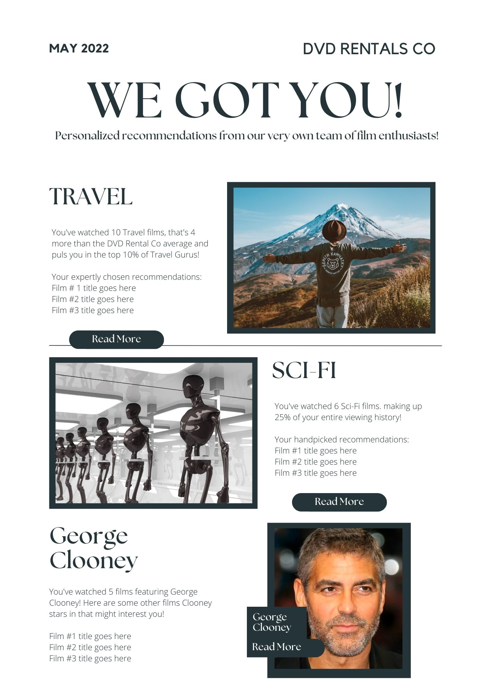
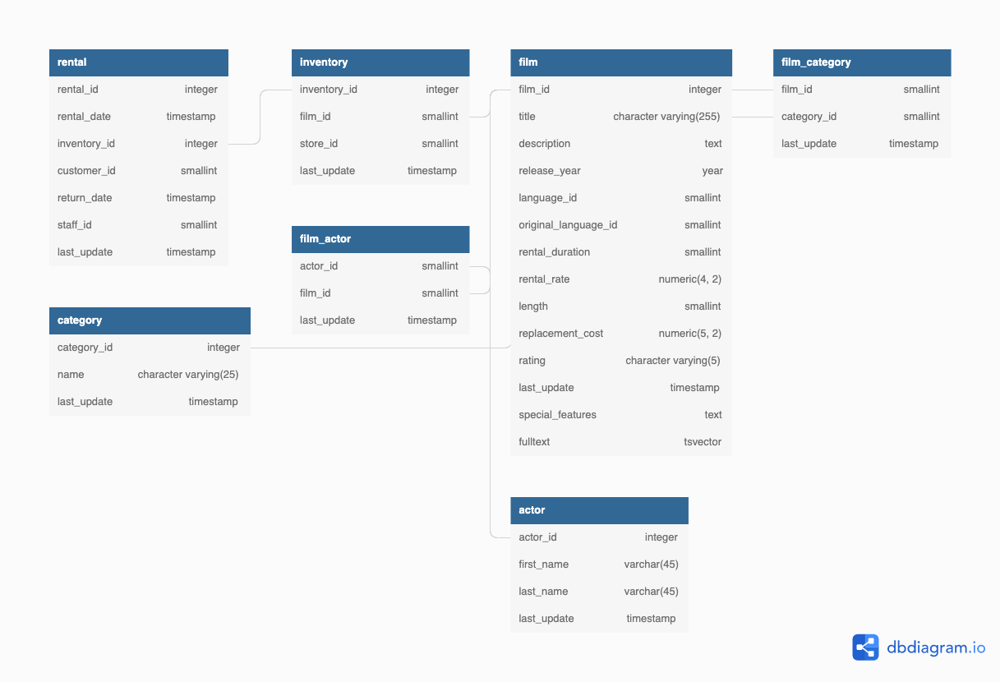

# Marketing Analytics Case Study
## Introduction
"Personalized customer emails based off marketing analytics is a winning formula for many digital companies, and this is exactly the initiative that the leadership team at DVD Rental Co has decided to tackle!

We have been asked to support the customer analytics team at DVD Rental Co who have been tasked with generating the necessary data points required to populate specific parts of this first-ever customer email campaign.

Throughout this marketing case study we will cover many SQL data manipulation and analysis techniques. The aim is to further extend your SQL knowledge base and also expose you to some scenarios where you can apply some neat tricks that I’ve picked up over the years!"

### The newsletter content

## Requirements

 1. Identify top 2 categories for each customer based off their past
    rental history
 2.  For each customer recommend up to 3 popular unwatched films for each category
 3.  Generate 1st category insights that includes:
	    - How many total films have they watched in their top category?
	    - How many more films has the customer watched compared to the average DVD Rental Co customer?
	    - How does the customer rank in terms of the top X% compared to all other customers in this film category?
4.  Generate 2nd insights that includes:
	-   How many total films has the customer watched in this category?
    -   What proportion of each customer’s total films watched does this count make?
5.  Identify each customer’s favorite actor and film count, then recommend up to three more unwatched films starring the same actor

## [ERD](https://dbdiagram.io/d/629e608a54ce2635276e3416)

